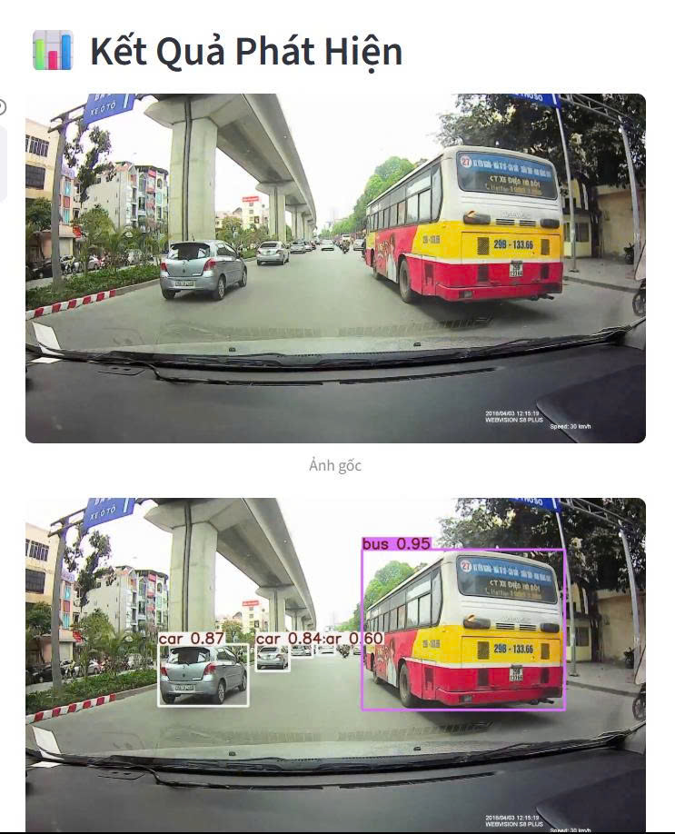
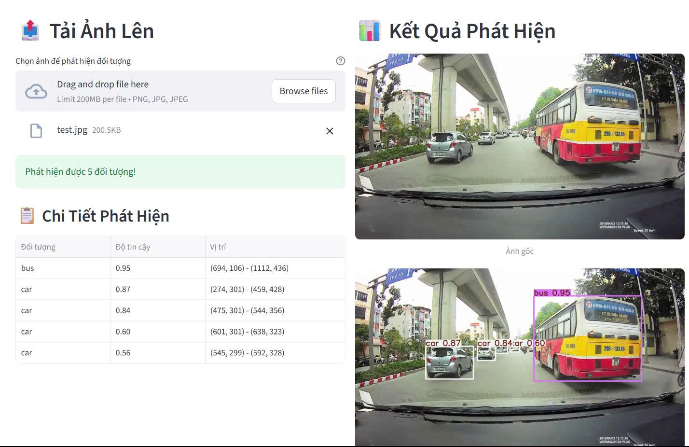
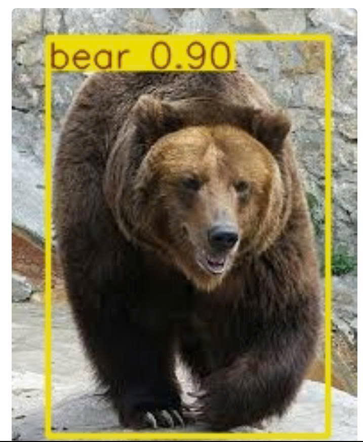
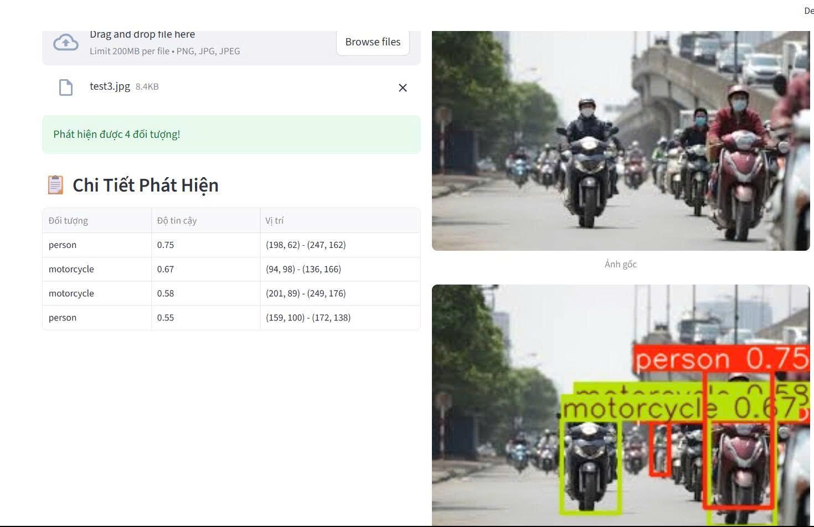
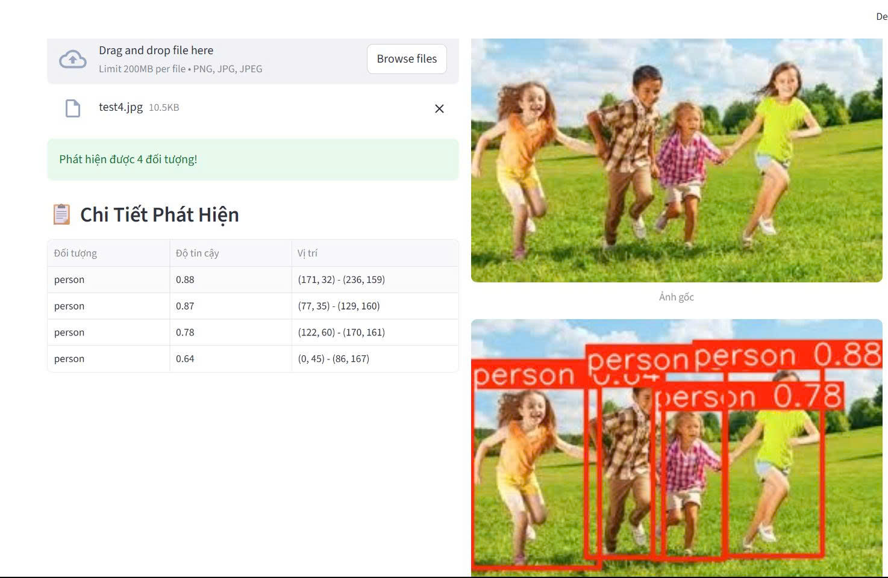

# 🔍 Ứng Dụng Phát Hiện Đối Tượng với YOLOv8

Ứng dụng web đơn giản được xây dựng bằng Streamlit để phát hiện đối tượng sử dụng mô hình YOLOv8.

## ✨ Tính Năng

- 📤 **Tải ảnh lên**: Hỗ trợ định dạng PNG, JPG, JPEG
- 🎯 **Phát hiện đối tượng**: Sử dụng YOLOv8 để phát hiện 80+ loại đối tượng
- ⚙️ **Điều chỉnh ngưỡng tin cậy**: Tùy chỉnh độ chính xác phát hiện
- 📊 **Hiển thị kết quả chi tiết**: Bảng thông tin về đối tượng được phát hiện
- 🎨 **Giao diện đẹp**: Thiết kế responsive và thân thiện người dùng

## 🚀 Cài Đặt

### Yêu Cầu Hệ Thống
- Python 3.8 trở lên
- RAM: Tối thiểu 4GB (khuyến nghị 8GB)
- GPU: Không bắt buộc (có thể chạy trên CPU)

### Bước 1: Clone Repository
```bash
git clone <repository-url>
cd YOLOv8_ObjectDetection
```

### Bước 2: Tạo Virtual Environment (Khuyến nghị)
```bash
# Windows
python -m venv venv
venv\Scripts\activate

# macOS/Linux
python3 -m venv venv
source venv/bin/activate
```

### Bước 3: Cài Đặt Dependencies
```bash
pip install -r requirements.txt
```

## 🏃‍♂️ Chạy Ứng Dụng

### Chạy ứng dụng Streamlit:
```bash
streamlit run app.py
```

Ứng dụng sẽ mở tại: `http://localhost:8501`

## 📸 Demo Kết Quả

### Ví dụ phát hiện đối tượng:


*Phát hiện xe bus và ô tô với độ tin cậy cao*


*Phát hiện người và các đối tượng khác*


*Phát hiện xe cộ và giao thông*


*Phát hiện đối tượng trong môi trường khác nhau*


*Kết quả phát hiện với độ tin cậy cao*

## 📖 Hướng Dẫn Sử Dụng

### 1. Tải Ảnh Lên
- Nhấp vào nút "Browse files" trong phần "Tải Ảnh Lên"
- Chọn file ảnh (PNG, JPG, JPEG)
- Ảnh sẽ được hiển thị và tự động xử lý

### 2. Điều Chỉnh Cài Đặt
- Sử dụng thanh trượt "Ngưỡng tin cậy" trong sidebar
- Giá trị từ 0.1 đến 1.0 (mặc định: 0.5)
- Giá trị cao hơn = ít đối tượng được phát hiện nhưng chính xác hơn

### 3. Xem Kết Quả
- Ảnh gốc và ảnh sau phát hiện được hiển thị song song
- Bảng chi tiết hiển thị:
  - Tên đối tượng được phát hiện
  - Độ tin cậy (confidence score)
  - Vị trí bounding box

## 🎯 Các Loại Đối Tượng Được Phát Hiện

YOLOv8 có thể phát hiện 80+ loại đối tượng bao gồm:
- 🚗 Xe cộ (car, truck, bus, motorcycle)
- 👥 Con người (person)
- 🐕 Động vật (dog, cat, horse, cow, sheep)
- 🏠 Đồ vật (chair, table, bed, sofa)
- 📱 Thiết bị điện tử (laptop, cell phone, remote)
- 🍽️ Đồ dùng nhà bếp (cup, bowl, fork, knife)
- Và nhiều loại khác...

## 🔧 Tùy Chỉnh

### Thay Đổi Model
Để sử dụng model khác, chỉnh sửa dòng trong `app.py`:
```python
model = YOLO('yolov8n.pt')  # Model nhỏ (nhanh)
# model = YOLO('yolov8s.pt')  # Model nhỏ
# model = YOLO('yolov8m.pt')  # Model trung bình
# model = YOLO('yolov8l.pt')  # Model lớn
# model = YOLO('yolov8x.pt')  # Model lớn nhất (chính xác nhất)
```

### Thêm Tính Năng Mới
- Lưu ảnh kết quả
- Phát hiện video
- Export kết quả ra file
- Tùy chỉnh màu sắc bounding box

## 🐛 Xử Lý Lỗi Thường Gặp

### Lỗi: "Không thể tải model"
- Kiểm tra kết nối internet
- Model sẽ được tải tự động lần đầu chạy
- Có thể mất vài phút tùy thuộc tốc độ mạng

### Lỗi: "Module not found"
- Chạy lại: `pip install -r requirements.txt`
- Kiểm tra virtual environment đã được kích hoạt

### Lỗi: "Out of memory"
- Giảm kích thước ảnh đầu vào
- Sử dụng model nhỏ hơn (yolov8n.pt)
- Đóng các ứng dụng khác để giải phóng RAM

## 📁 Cấu Trúc Dự Án

```
YOLOv8_ObjectDetection/
├── app.py              # Ứng dụng Streamlit chính
├── requirements.txt    # Dependencies
├── README.md          # Hướng dẫn này
├── .gitignore         # File loại trừ Git
├── images/            # Thư mục chứa ảnh test
└── result/            # Thư mục chứa ảnh kết quả demo
```

## 🤝 Đóng Góp

Nếu bạn muốn đóng góp vào dự án:
1. Fork repository
2. Tạo branch mới cho tính năng
3. Commit changes
4. Tạo Pull Request

## 📄 License

Dự án này được phát hành dưới MIT License.

## 🙏 Cảm Ơn

- [Ultralytics](https://github.com/ultralytics/ultralytics) - YOLOv8
- [Streamlit](https://streamlit.io/) - Framework web
- [OpenCV](https://opencv.org/) - Xử lý ảnh

---

**Lưu ý**: Lần đầu chạy ứng dụng, model YOLOv8 sẽ được tải tự động từ internet. Quá trình này có thể mất vài phút tùy thuộc tốc độ mạng.
